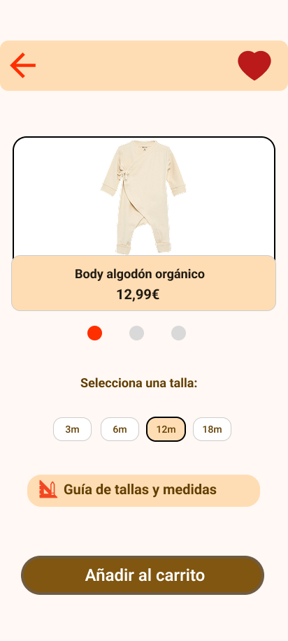

# Estilo Infantil · Moda Infantil Sostenible
> Prototipo de aplicación móvil enfocado en moda infantil.

---

### Enlaces clave del proyecto
* **Archivo de trabajo en Figma:** [Ver archivo editable](https://www.figma.com/file/eSl1MPKihRMDb6xmJBO0P8/T1-%C2%B7-Peque%C3%B1os-Pasos-%C2%B7-Javier-Gallego)
* **Prototipo interactivo:** [Probar prototipo en Figma](https://www.figma.com/proto/eSl1MPKihRMDb6xmJBO0P8/T1-%C2%B7-Peque%C3%B1os-Pasos-%C2%B7-Javier-Gallego?node-id=40-273&p=f&viewport=443%2C226%2C1&t=AIikGI9638T8MFwM-1&scaling=scale-down&content-scaling=fixed&starting-point-node-id=40%3A273&show-proto-sidebar=1&page-id=40%3A272)

---

### Captura destacada

---

## Índice de contenidos

* [1. Introducción](documentacion.md#sección-1-justificación-del-diseño)
* [2. Investigación y análisis](documentacion.md#sección-2-investigación-y-análisis-de-usuarios)
* [3. Diseño de interfaz](documentacion.md#sección-3-diseño-de-la-interfaz)
* [4. Validación y pruebas](documentacion.md#sección-4-validación-y-pruebas)
* [5. Entrega y documentación final](documentacion.md#sección-5-entrega-y-documentación-final)
* [6. Referencias bibliográficas](documentacion.md#sección-6-referencias-bibliográficas)

---