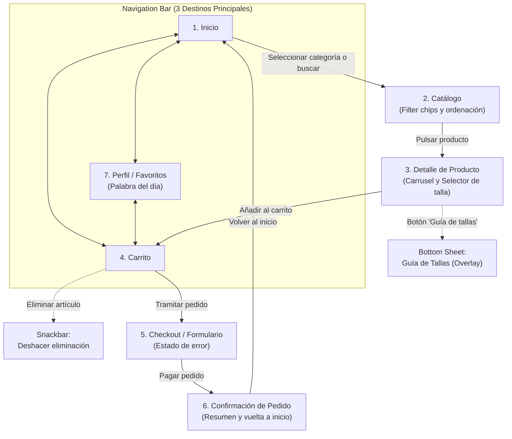
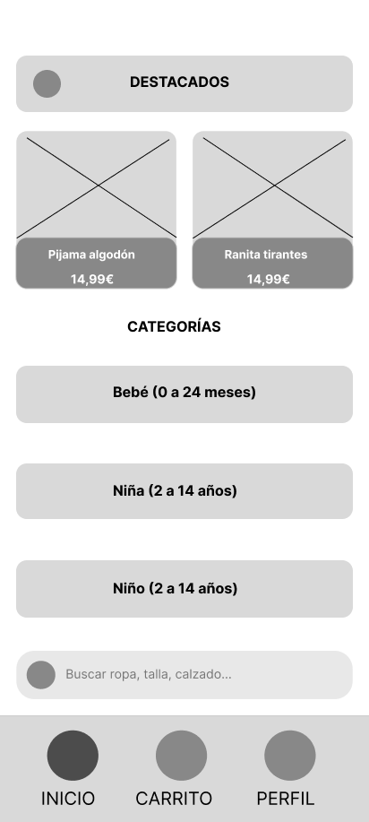
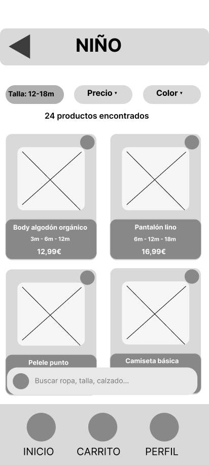
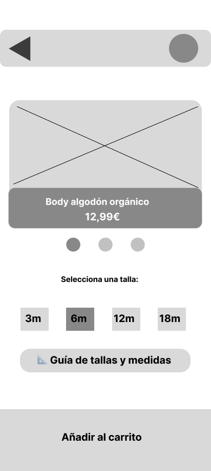
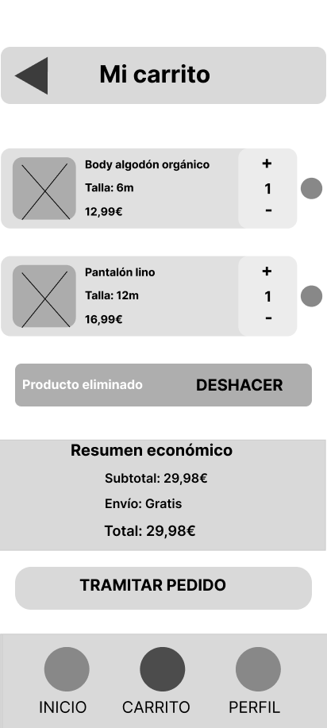
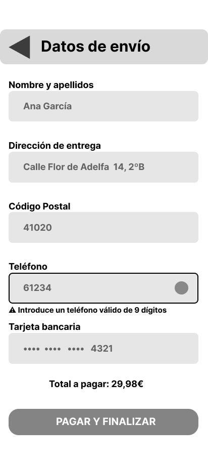
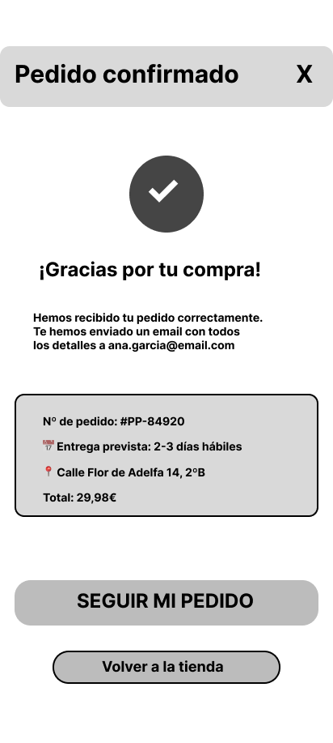
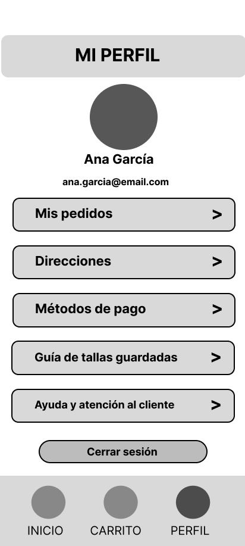

# Documentación de la interfaz — Pequeños Pasos

## SECCIÓN 1: Justificación del diseño

### 1.1.-Importancia del diseño centrado en el usuario

Los usuarios principales del sector de la moda infantil, es decir, los padres, siempre están en compras bajo estrés temporal, multitarea y uso del dispositivo móvil con una sola mano, a lo que se le suma el problema de la talla, debido al rápido crecimiento infantil, el cual provoca miedo al elegir una talla incorrecta, permitiendo la existencia de devoluciones. Al adoptar un enfoque de Diseño Centrado en el Usuario se evita la carga mental de la interfaz, teniendo elementos importantes al alcance del pulgar y herramientas visuales para resolver dudas.

### 1.2.-Objetivos y metas del proyecto

* **Reducción del tiempo de compra:** Permitir que, en poco tiempo, el usuario pueda encontrar el producto que desee y elegir su talla 

* **Claridad en la sección de la talla:** Evitar el abandono de los usuarios permitiendo que la mayor parte de los usuarios puedan añadir los artículos a la cesta sin retroceder

* **Eficiencia en navegación con una sola mano:** Permitir que los usuarios puedan navegar fácilmente por la interfaz de la aplicación utilizando exclusivamente controles interactivos ubicados en la zona del pulgar

### 1.3.-Beneficios esperados

* Que el usuario pueda comprar los productos sin ningún tipo de problema, evitando así que abandone la compra
* Seguridad a la hora de elegir tallas mediante equivalencias directas
* Interfaz accesible para aquellos no acostumbrados a las tecnologías

## SECCIÓN 2: Investigación y análisis de usuarios

### 2.1.-Datos demográficos y segmentación

El público objetivo de esta aplicación serían:

* **Padres y madres:** Adaptados a la digitalización, compran en momentos libres, y priorizan la rapidez, el filtro ágil por edad y la facilidad de pago
* **Compradores de regalos o abuelos:** Compradores puntuales que pueden tener menos familiaridad con interfaces complejas y desconocen las medidas exactas de los niños

### 2.2.-Personas

#### Persona 1: Ana García (Madre de 30 años)

Suele abrir la aplicación cuando está libre, usando exclusivamente el móvil con la mano derecha. Ella busca reponer ropa básica que a sus hijos les queda pequeña de forma rápida. Como frustraciones cuenta con los formularios de checkout, los pequeños selectores de talla despegables o aplicaciones que borran productos del carrito sin opción de recuperarlos

#### Persona 2: Marcos Martín (Abuelo de 78 años)

Compra usando gafas para poder ver la pantalla y quiere hacerle un regalo a su nieta de 3 años. Él quiere encontrar una prenda sin consultar con los padres. Como frustraciones cuenta con las letras pequeñas, nombres técnicos de prendas o la posibilidad de equivocarse de talla

### 2.3.-Análisis de la competencia

| Competidor | Qué hace bien | Qué hace mal | Qué nos llevamos para Pequeños Pasos |
| :--- | :--- | :--- | :--- |
| **Mayoral** | Categorización muy detallada por tramos de meses y edades en el menú inicial. | Los filtros son pequeños y difíciles de tocar a una mano, además de que la guía de tallas es un enlace externo lento que saca al usuario del flujo. | Filtros mediante Filter Chips táctiles y apertura de guía de tallas sin salir de la ficha. |
| **Zara Kids** | Estética visual limpia y navegación por gestos moderna. | Textos grises con muy bajo contraste, iconos sin etiqueta y botones fuera de la zona accesible del pulgar. | Mantener un aspecto limpio pero aplicando ratios de contraste y Navigation Bar. |
| **H&M Kids** | Buen flujo de checkout simplificado y resumen claro del coste y gastos de envío en el carrito. | La eliminación de productos es inmediata sin confirmación clara y no permite deshacer fácilmente si te equivocas de botón. | Integración de la acción «Deshacer» tras eliminar cualquier prenda del carrito para reducir la frustración. |

### 2.4.-Insights y hallazgos claves

* **Incertidumbre con las tallas infantiles:** Los compradores suelen dudar entre dos tallas y temen que la ropa quede pequeña en muy poco tiempo. Como **Decisión de Diseño**, se incluiría un componente que permite seleccionar tallas con badges de disponibilidad y un botón que despliega una tabla de percentiles y edades sin recargar la página
* **Uso predominante de una mano:** Las compras se pueden realizar cuando se atiende al niño, lo que puede dificultar el alcance a la parte superior de la pantalla. Como **Decisión de Diseño**, se implementaría una barra de navegación en la parte inferior
* **Miedo a errores accidentales en el carrito:** Al hacer la compra rápido, los usuarios podrían tocar sin querer el botón para eliminar el carrito, perdiendo así su selección. Como **Decisión de Diseño**, se mostraría un botón de "Deshacer" al eliminar un producto del carrito para restaurarlo inmediatamente
* **Abandono ante validaciones de checkout confusas:** Los formularios que solo marcan errores generales sin especificar el campo que falló hacen que los usuarios más mayores abandonen la aplicación. Como **Decisión de Diseño**, habría que usar text fields con estados de error integrados

## SECCIÓN 3: Diseño de la interfaz

### 3.1.-Mapa de navegación

### 3.2.-Wireframes

#### Pantalla 1: Inicio

#### Pantalla 2: Catálogo

#### Pantalla 3: Detalle de producto

#### Pantalla 4: Carrito de compra

#### Pantalla 5: Checkout

#### Pantalla 6: Confirmación

#### Pantalla 7: Perfil

### 3.3.-Guía de estilo Material Design 3

* **primary/onPrimary(Claro):** Ratio de 6.44
* **primaryContainer/onPrimaryContainer(Claro):** Ratio de 7.25
* **secondary/onSecondary(Claro):** Ratio de 6.44
* **tertiary/onTertiary(Claro):** Ratio de 6.45
* **surface/onSurface(Claro):** Ratio de 16.23
* **error/onError(Claro):** Ratio de 6.46

* **primary/onPrimary(Oscuro):** Ratio de 7.69
* **primaryContainer/onPrimaryContainer(Oscuro):** Ratio de 7.25
* **secondary/onSecondary(Oscuro):** Ratio de 7.73
* **tertiary/onTertiary(Oscuro):** Ratio de 7.68
* **surface/onSurface(Oscuro):** Ratio de 14.34
* **error/onError(Oscuro):** Ratio de 7.71

Palabra del día: 29